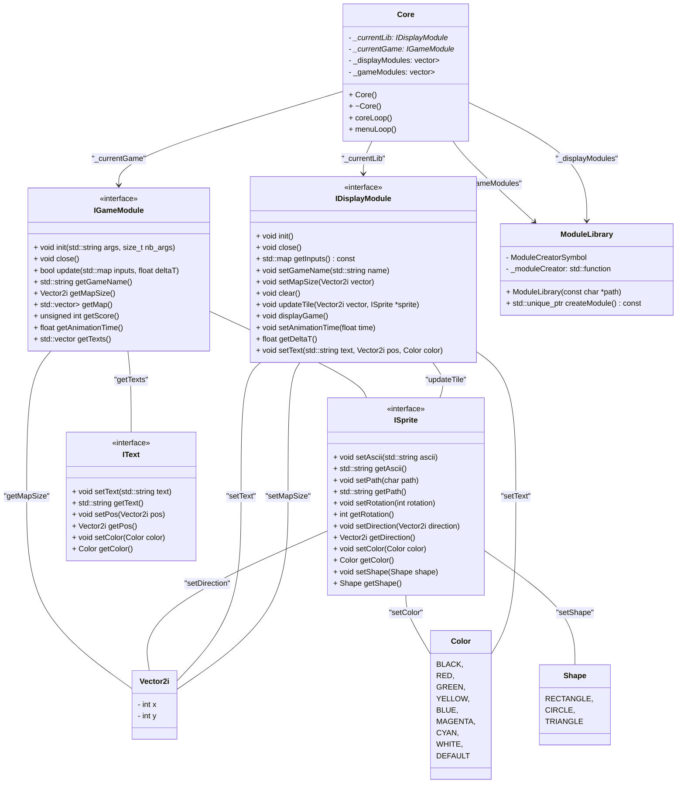

# Arcade

<b>binary name:</b> arcade
<b>language:</b> C++
<b>compilation:</b> via Makefile (`all`, `clean`, `fclean`, `re`) or CMake

> [!CAUTION]
>
> - The totality of your source files, except all useless files (binary, temp files, obj files,...), must be included in your delivery.
> - All the bonus files (including a potential specific Makefile) should be in a directory named bonus.
> - Error messages have to be written on the error output, and the program should then exit with the 84 error code (0 if there is no error).

Arcade is a **gaming platform**: a program that lets the user choose a game to play and keeps a register of player scores.
To be able to deal with the elements of your gaming plateform at run-time, your graphics libraries and your games must be implemented as **dynamic libraries**, loaded at runtime.

Each GUI available for the program must be used as a shared library that will be loaded and used dynamically by the main
program.

> [!CAUTION]
> It is STRICTLY FORBIDDEN to refer to a graphics library explicitly in your main program.
> Only your dynamic libraries can do so.
> This also applies to your games.

## Usage

The program must take as a startup argument the graphics library to use initially. It must nevertheless be possible to change the graphics library at run-time.

```shell
∼/B-OOP-400> ./arcade ./lib/arcade_ncurses.so
```

## Implementation of new graphics or game libraries

The Arcade project is designed to be extensible, allowing developers to implement new graphics or game libraries. [Here's how you can implement them.](doc/IMPLEMENT.md)

## Key bindings

Here's a Markdown table to explain the keys and their corresponding actions:

| Key   | Action                       | Arcade::Displays::KeyType |
|-------|------------------------------|---------------------------|
| KEY_UP| Move Up                      | VER                       |
| KEY_DOWN | Move Down                  | VER                       |
| KEY_LEFT | Move Left                  | HOR                       |
| KEY_RIGHT | Move Right                | HOR                       |
| 'O'   | Previous Library             | PREV_LIB                  |
| 'P'   | Next Library                 | NEXT_LIB                  |
| 'L'   | Previous Game                | PREV_GAME                 |
| 'M'   | Next Game                    | NEXT_GAME                 |
| 'W'   | Action 1                     | ACTION1                   |
| 'X'   | Action 2                     | ACTION2                   |
| 'C'   | Action 3                     | ACTION3                   |
| 'V'   | Action 4                     | ACTION4                   |
| 'Q'   | Quit                         | QUIT                      |
| ESCAPE    | Escape                       | ESC                       |
| 'R'   | Restart                      | RESTART                   |

This table provides a clear overview of the keys and their associated actions mapped to the `Arcade::Displays::KeyType`.

## Table of Contents

- [LIBRARIES](doc/LIBRARIES.md)
  - [DYNAMIC LIBRARIES](doc/LIBRARIES.md#dynamic-libraries)
  - [GRAPHICS LIBRARIES](doc/LIBRARIES.md#graphics-libraries)
  - [GAMES](doc/LIBRARIES.md#games)
- [USAGE](doc/USAGE.md)
- [BUILD](doc/BUILD.md)
  - [Makefile](doc/BUILD.md#makefile)
  - [CMake](doc/BUILD.md#cmake)
- [GAMES](doc/GAMES.md)
  - [Snake](doc/GAMES.md#snake)
  - [Nibbler](doc/GAMES.md#nibbler)
  - [Pacman](doc/GAMES.md#pacman)
  - [Qix](doc/GAMES.md#qix)
  - [Centipede](doc/GAMES.md#centipede)
  - [Solarfox](doc/GAMES.md#solarfox)

## Mermaid Diagram



## Contributions

Project members:

- [Thibaut HH.](https://github.com/ThibautHH)
- [Guillaume B.](https://github.com/Gaulaume)
- [Louis L.](https://github.com/LouisLanganay)

Partner project with which we have shared interfaces: [neo-jgrec/arcade](https://github.com/neo-jgrec/arcade)
