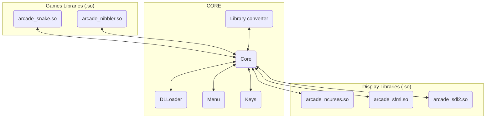

# Implementing New Graphics or Game Libraries

The Arcade project is designed to be extensible, allowing developers to implement new graphics or game libraries. Here's how you can implement them:

> [!IMPORTANT]
> These dynamic libraries can be seen as plug-ins providing various capabilities to your main program.  
> In NO CASE must graphics libraries influence the game logic.  
> Game libraries must not contain any information about screen rendering or low-level events.  
> Your libraries (games and graphics) binaries (``*.so``) must be placed in the ``./lib/`` directory at the root of the repository  

## Graphics Library

### Description

The `IDisplayModule` class defines the interface for display modules within the Arcade project. Display modules handle rendering graphics, processing user input, and managing the game display.

### Public Member Functions

- **`init(void)`**: Initializes the display module.
- **`close(void)`**: Closes the display module.
- **`getInputs(void) -> std::map<KeyType, int>`**: Retrieves user input events.
- **`setMapSize(Vector2i vector)`**: Sets the size of the game map.
- **`clear(void)`**: Clears the display.
- **`updateTile(Vector2i vector, ISprite *sprite)`**: Updates a tile on the display with the specified sprite.
- **`displayGame(void)`**: Updates the display after drawing the game map.
- **`setAnimationTime(float time)`**: Sets the animation time for the display.
- **`getDeltaT(void) -> float`**: Retrieves the time delta.
- **`setText(std::string text, Vector2i pos, Color color)`**: Sets text on the display at the specified position with the given color.

### Entry Point

The entry point for the graphics library is the `displayEntryPoint` function, which returns a pointer to an instance of the display module.
The delete point for the graphics library is the `deletePoint` function, which deletes the instance of the display module.

```cpp
extern "C" Arcade::Displays::IDisplayModule *displayEntryPoint()
```

```cpp
extern "C" void deletePoint(Arcade::Displays::IDisplayModule *display)
```

## Games Library

### Description

The `IGameModule` class defines the interface for game modules within the Arcade project. Game modules contain the logic and mechanics for individual games.

### Public Member Functions

- **`init(std::string args, size_t nb_args)`**: Initializes the game module with arguments.
- **`close(void)`**: Closes the game module.
- **`update(std::map<KeyType, int> inputs, float deltaT) -> bool`**: Updates the game state based on user inputs and time delta.
- **`getMapSize() -> Vector2i`**: Retrieves the size of the game map.
- **`getMap() -> std::vector<std::vector<ISprite *>>`**: Retrieves the game map.
- **`getScore() -> std::string`**: Retrieves the current game score.
- **`getAnimationTime() -> float`**: Retrieves the animation time for the game.
- **`getTexts() -> std::vector<std::tuple<std::string, Vector2i, Color>>`**: Retrieves texts to be displayed in the game.

### Entry Point

The entry point for the game library is the `gameEntryPoint` function, which returns a pointer to an instance of the game module.
The delete point for the game library is the `deletePoint` function, which deletes the instance of the game module.

```cpp
extern "C" Arcade::Games::IGameModule *gameEntryPoint()
```

```cpp
extern "C" void deletePoint(Arcade::Games::IGameModule *game)
```

## Architecture Diagram

